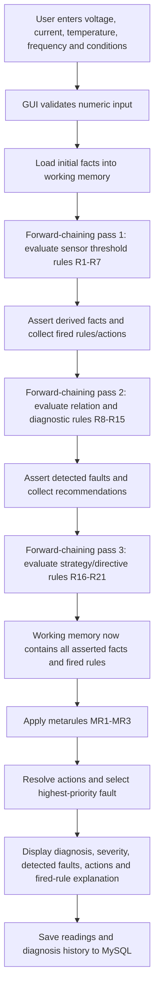

# Inference Flow Diagram

The working memory contains initial observations such as `overcurrent_condition`
and `normal_frequency_condition`. Rules add derived fault facts, and later rules
use those facts when selecting additional diagnoses and recommendations.
